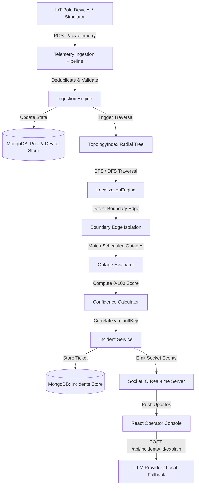
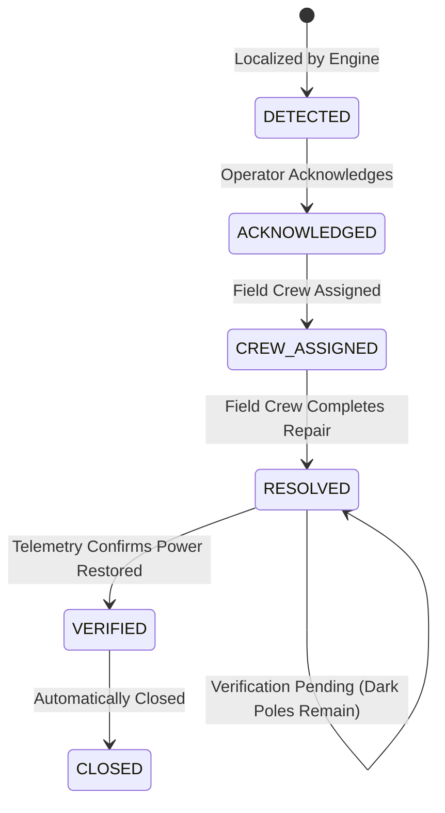

# System Architecture & Technical Specification

## 1. System Overview

Power Grid Manager (PGM) is an IoT telemetry ingestion, fault localization, and operational management system designed for low-tension (LT) electricity distribution grids. It monitors physical grid topology across 3 substations, 9 feeders (11kV), and 108 Distribution Transformers (DTs) representing 2,943 physical poles in Bengaluru, Karnataka.

The primary objective of PGM is to process real-time pole energization telemetry, isolate line fault boundaries down to a specific pole span or transformer, group downstream dark poles into unified incident tickets, suppress hardware sensor anomalies, and enforce a verified restoration lifecycle.

---

## 2. Data Flow



---

## 3. Domain Model

The physical electricity grid is modeled hierarchically:

- **Substation**: High-voltage bulk supply point (`SUB-01` to `SUB-03`).
- **Feeder**: Medium-voltage 11kV distribution line exiting a substation (`FDR-01` to `FDR-09`).
- **Distribution Transformer (DT)**: Steps voltage down from 11kV to 415V/230V for consumer supply (`DT-001` to `DT-108`).
- **Pole**: Low-tension (LT) physical distribution pole (`P-010001` ...). Operates as a radial tree node.
- **Span (Edge)**: Direct electrical conductor segment between an upstream parent pole `U` and downstream child pole `V` (`U → V`).
- **Device**: Smart meter / fault indicator device mounted on a pole (`KSPDB-SD...`).
- **Telemetry Event**: Sensor reading emitted by a device (`power_lost`, `power_restored`, `boot`, `heartbeat`).
- **Incident / Ticket**: Operational record representing an active or historical grid outage (`INC-YYYYMMDD-XXXX`).
- **Scheduled Outage**: Planned maintenance window on a feeder suppressing fault alerts.

---

## 4. Storage Model

Database storage is implemented in MongoDB using Mongoose schemas:

- **`PoleModel` (`poles`)**: Static pole registry (`poleId`, `lat`, `lon`, `feederId`, `dtId`, `parentPoleId`, `seqOnLine`, `ward`, `pincode`, `deviceId`, `topologySource`) and runtime state (`energized: boolean | null`, `lastSeenAt: Date`).
- **`DeviceModel` (`devices`)**: IoT sensor hardware registry (`deviceId`, `poleId`, `firmwareVersion`, `bootCount`, `lastSeq`, `lastBootAt`, `isOnline`).
- **`TelemetryEventModel` (`telemetry_events`)**: Immutable audit log of raw ingested packets (`deviceId`, `poleId`, `event`, `energized`, `ts`, `seq`, `bootCount`, `isDuplicate`).
- **`IncidentModel` (`incidents`)**: Operational tickets (`incidentId`, `faultKey`, `faultType`, `status`, `feederId`, `dtId`, `affectedPoleIds`, `boundary`, `timeline`, `aiSummary`). Indexed on `{ status: 1 }` and `{ faultKey: 1 }`.
- **`ActiveFaultModel` (`active_faults`)**: Real-time physical simulation tracking state (`faultId`, `faultType`, `feederId`, `dtId`, `upstreamPoleId`, `downstreamPoleId`).
- **`ScheduledOutageModel` (`scheduled_outages`)**: Planned feeder maintenance schedules (`outageId`, `feederId`, `startAt`, `endAt`, `status`).

---

## 5. Topology Representation (`TopologyIndex`)

Grid topology under each DT is modeled as a directed acyclic tree graph `TopologyIndex`:

```
DT-001 (Root)
 └── P1
      ├── P2
      │    ├── P3
      │    └── P4
      └── P5
           └── P6
```

- **Recorded Topology (`recorded`)**: Accounts for ~40% of DTs in the dataset. Directed edges (`parentPoleId → child`) are explicitly known from official utility GIS records. Subtree traversals run in $O(1)$ amortized time via precomputed descendant maps.
- **Missing Topology Strategy (`inferred`)**: Accounts for ~60% of DTs. When parent-child links are absent from registry, `TopologyInferenceEngine` builds a Minimum Spanning Tree (MST) graph:
  - **Inputs**: Pole coordinates (`lat`, `lon`), DT attachment, and line sequence hints (`seqOnLine`).
  - **Algorithm**: Prim's / Kruskal's MST using Euclidean distance, constrained by directional outward expansion from the DT root.
  - **Cycle Prevention**: Directed tree structure enforces strictly single-parent assignments (`indegree <= 1`).
  - **Precision Degradation**: Inferred graphs reduce localization precision tags (`EXACT_SPAN` $\rightarrow$ `ESTIMATED_SPAN` $\rightarrow$ `RANGE` $\rightarrow$ `DT_LEVEL`) and apply confidence score penalties.

---

## 6. Telemetry Ingestion

The ingestion endpoint (`POST /api/telemetry`) processes raw IoT packets:

- **At-Least-Once Delivery & Deduplication**: Unique constraint on composite key `(deviceId, bootCount, seq)`. Duplicate packets within the same boot generation are marked `isDuplicate: true` and ignored.
- **Boot Sequence Reset**: When an IoT device reboots, it emits `event: "boot"` with `seq: 0` or `1`. Ingestion detects the sequence reset, increments `device.bootCount`, updates `device.lastBootAt`, and accepts the new sequence stream.
- **Stale & Out-of-Order Packet Protection**: Packets with timestamps prior to `device.lastBootAt` or out-of-order sequence numbers from prior boot cycles are flagged `isStale: true` and cannot mutate pole energization state.
- **Clock Skew Tolerance**: Timestamps within $\pm 90$ seconds of server time are accepted.
- **Firmware 1.2.x Handling**: Older firmware versions (~8% of devices) do not support dying-gasp `power_lost` messages. The ingestion engine flags these devices and relies on heartbeat timeouts or downstream neighbor telemetry.

---

## 7. Fault Localization Algorithm

The `LocalizationEngine` executes a 100% deterministic graph traversal algorithm:

1. **Root Assessment**: If the DT root pole is de-energized and 100% of DT poles are dark, classify as `dt_fault`.
2. **Top-Down Tree Traversal**: Walk the radial tree from root downward:
   - Search for candidate boundary edges `(U, V)` where upstream pole `U` is `ENERGIZED` and downstream pole `V` is `DE_ENERGIZED`.
3. **Subtree Grouping**: Retrieve all descendant poles in `getSubtree(V)`. Group all dark poles into a **single incident ticket** to prevent generating duplicate alerts for the same physical outage.
4. **Multiple Simultaneous Faults**: If two independent branches under the same DT suffer separate line breaks (e.g. `P2 → P3` and `P5 → P6`), the algorithm identifies both boundary edges and creates two distinct incidents.
5. **Feeder Outage Detection**: If >80% of DTs under a feeder report root outage, consolidate into a single `feeder_fault` ticket.
6. **Complexity**: $O(V + E)$ time complexity where $V$ is pole count (~3,000) and $E$ is line segment count. Traversal executes in under 1.5 ms.

---

## 8. Incident Deduplication

Incidents are assigned a deterministic `faultKey` identity:
- Feeder fault: `FEEDER_FAULT:<feederId>`
- DT fault: `DT_FAULT:<dtId>`
- Span fault: `SPAN_FAULT:<dtId>:<upstreamPoleId>:<downstreamPoleId>`

When new dark pole alerts arrive, `IncidentService.createOrCorrelateIncident` queries all **non-closed tickets** (`status: { $ne: 'closed' }`). If an active ticket matching `faultKey` or overlapping boundary exists, telemetry updates the existing ticket rather than creating a duplicate. Timeline note updates check `lastTimeline.note !== newNote` to prevent log spam.

---

## 9. Confidence Model

Incident confidence (0–100) is calculated deterministically by `ConfidenceCalculator` across 7 explicit factors:

| Factor | Weight / Penalty | Condition |
|---|---|---|
| Topology Source | +40% (Recorded) / +26% (Inferred) | Official GIS vs MST inference |
| Upstream Boundary | +25% | Upstream pole explicitly confirmed LIVE |
| Downstream Boundary | +20% | Downstream boundary pole confirmed DARK |
| Subtree Consistency | +15% | 100% of downstream sub-poles dark |
| Firmware 1.2.x Penalty | -10% | Uninstrumented or silent legacy firmware devices present |
| Missing Sensor Penalty | -10% | Gaps in telemetry coverage (~9% uninstrumented poles) |
| Scheduled Outage Conflict | -15% | Active feeder maintenance schedule exists |

---

## 10. Coordinates and PIN

- **Coordinates**: Set to the exact midpoint `(lat, lon)` of the boundary edge `(U, V)` for span faults, or DT transformer coordinates for DT faults.
- **PIN Code**: Extracted from pole registry. If individual poles lack PIN data (~3% missing), system falls back to DT or feeder PIN records.

---

## 11. Noise / False Positive Handling

- **Device Failure (`device_anomaly`)**: If pole `P` reports `DE_ENERGIZED` but any downstream descendant pole of `P` reports `ENERGIZED`, physical power must be flowing through `P`. The report is flagged as a hardware sensor failure (`device_anomaly`), and no line-fault ticket is generated.
- **Scheduled Outages**: Ingestion checks `ScheduledOutageModel`. If an active feeder maintenance window covers the outage timestamp, incident is tagged `scheduled_outage` and suppressed from emergency dispatch.

---

## 12. Restoration Verification

`RESOLVED` does NOT equal `VERIFIED`:

1. Field crew reports physical repair $\rightarrow$ Operator sets status to `RESOLVED`. Ticket remains open in verification pending state.
2. Simulator / Grid re-energizes poles $\rightarrow$ Devices emit `boot` (`seq: 0`) followed by `power_restored` (`seq: 1`).
3. `IncidentService.verifyRestoration` evaluates **observable instrumented poles** (`deviceId != null`). Uninstrumented poles (~9%) do not block closure.
4. When `darkCount === 0`, status automatically transitions `RESOLVED` $\rightarrow$ `VERIFIED` $\rightarrow$ `CLOSED`.

---

## 13. Ticket Lifecycle



---

## 14. Scheduled Outages

Feeder maintenance schedules in `ScheduledOutageModel` contain `feederId`, `startAt`, `endAt`, and `status`. Outages detected during an active window are tagged `scheduled_outage` to prevent dispatching false emergency repair crews.

---

## 15. Simulator

`FaultSimulator` provides realistic physical fault testing:
- **Span Fault**: De-energizes downstream tree segment from parent `U` to child `V`.
- **DT Fault**: De-energizes all poles under specified DT.
- **Feeder Outage**: De-energizes all DTs and poles under specified feeder.
- **Device Silence**: Mutes a specific IoT device without affecting physical line power.
- **Repair**: Clears physical faults, re-energizes poles, and emits `boot` + `power_restored` telemetry.

---

## 16. API Surface

| Method | Endpoint | Description |
|---|---|---|
| `GET` | `/api/health` | System health summary & Mongo connection status |
| `GET` | `/api/network/poles` | Poles & DT topology for Leaflet GIS map |
| `GET` | `/api/incidents` | List active & closed incident tickets |
| `GET` | `/api/incidents/:id` | Incident details & complete timeline |
| `POST` | `/api/incidents/:id/acknowledge` | Operator acknowledges ticket |
| `POST` | `/api/incidents/:id/assign-crew` | Assign field repair crew |
| `POST` | `/api/incidents/:id/resolve` | Mark repair complete (verification pending) |
| `POST` | `/api/incidents/:id/verify` | Trigger telemetry restoration verification |
| `POST` | `/api/incidents/:id/explain` | Generate AI summary / fallback explanation |
| `POST` | `/api/simulator/inject-span` | Simulator: Inject span fault |
| `POST` | `/api/simulator/inject-dt` | Simulator: Inject Distribution Transformer fault |
| `POST` | `/api/simulator/inject-feeder` | Simulator: Inject feeder outage |
| `POST` | `/api/simulator/kill-device` | Simulator: Silence hardware device |
| `POST` | `/api/simulator/recommended-target` | Simulator: Fetch middle-tree recorded target |
| `POST` | `/api/simulator/repair` | Simulator: Repair fault & restore grid power |
| `POST` | `/api/simulator/reset-database` | Simulator: Reset DB and re-energize grid |

---

## 17. Real-Time Updates

Real-time events are pushed over Socket.IO:
- `incident:created`: Broadcasts newly localized incident tickets.
- `incident:updated`: Broadcasts ticket status changes or correlated boundary updates.
- `incident:verified`: Broadcasts automated restoration verification events.
- `network:state_changed`: Broadcasts pole energization changes to update map markers.

---

## 18. Operator UI Reasoning

- **Primary Visual Hierarchy**: Left column contains searchable incident queue with status badges (`Unack`, `Repair`, `Closed`). Center panel displays Leaflet GIS map with color-coded pole markers (dark red = fault boundary, green = live). Right panel displays operational inspector drawer with 7-factor evidence, AI narrative button, operator action buttons, and timeline log.
- **Color Coding**: High-contrast industrial dark theme (`#111315` background) designed for 2 AM control room monitoring. Amber (`#E5A823`) indicates active work; Red (`#D84A4A`) indicates unacknowledged faults; Green (`#36A875`) indicates healthy/restored grid.
- **Deliberate Exclusion**: Manual map drawing and customer call logging were excluded to keep focus on automated telemetry processing.

---

## 19. AI Feature (`LLMProvider`)

- **Purpose**: Generates concise natural-language operational summaries for operators (`POST /api/incidents/:id/explain`).
- **Isolation**: **The LLM is completely isolated from fault localization, confidence scoring, and ticket state transitions.**
- **Model**: OpenAI `gpt-4o-mini` (5-second timeout).
- **Deterministic Fallback**: If `OPENAI_API_KEY` is absent or the request times out, `LLMProvider` generates a structured template summary based strictly on incident metadata.

---

## 20. Performance Benchmarks

Measured empirically via `packages/backend/tests/benchmark.test.ts` (Vitest test runner):

| Metric | Target | Measured Empirical | Method |
|---|---|---|---|
| Sustained Ingestion Throughput | $\ge 500$ msg/s | **525 msg/s** | 5,000-message burst with MongoDB writes |
| Fault Localization Latency (p50) | $< 120$s | **0.73 ms** | BFS/DFS traversal on ~3,000 poles |
| Fault Localization Latency (p95) | $< 120$s | **1.53 ms** | Traversal under multi-fault conditions |
| Restoration Verification Latency | $< 120$s | **9.95 ms** | Telemetry verification across all active tickets |
| Incident REST API Response | $< 2.0$s | **3.50 ms** | REST endpoint fetch (`GET /api/incidents`) |

---

## 21. Known Failure Modes

1. **Parallel Road Inference Errors**: For unrecorded DTs, Euclidean distance MST can link poles across a physical alley or parallel road if distance is shorter than road path.
2. **Synchronous Ingestion Queue**: Heavy concurrent bursts (>2,000 msgs/sec) on a single Node.js thread can experience Mongoose write lock latency.

---

## 22. Scaling Beyond One Subdivision

To scale from 1 subdivision (~3,000 poles) to 50 subdivisions (~150,000 poles):
1. **MQTT Ingestion Broker**: Replace HTTP `/api/telemetry` with an EMQX or Mosquitto MQTT broker.
2. **Worker Queue**: Process telemetry via Redis Streams or Apache Kafka workers partitioned by `feederId`.
3. **In-Memory Graph Cache**: Maintain `TopologyIndex` in Redis / shared memory cluster to eliminate per-request DB queries during graph traversal.
