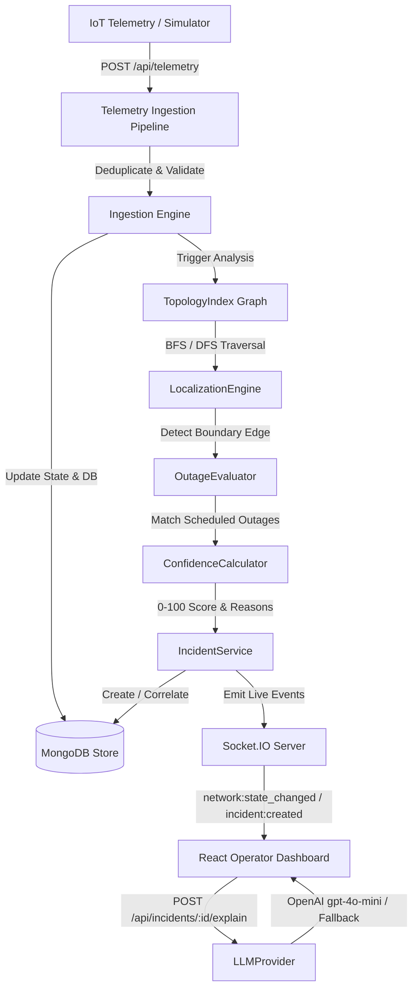

# System Architecture & Technical Specification

## System Overview

Power Grid Manager (PGM) is an IoT fault detection and operational management system built for the **Karnataka State Power Distribution Board (KSDB)**. PGM processes telemetry from ~3,000 poles across 108 Distribution Transformers (DTs) in Bengaluru, performing 100% deterministic fault localization and incident lifecycle tracking.

---

## 1. Telemetry Ingestion Pipeline

The ingestion pipeline handles raw HTTP telemetry messages sent by IoT devices mounted on physical LT poles.

### Ingestion Requirements & Rules:
1. **Deduplication Key**: Messages are indexed by composite key `(device_id, seq)`. Duplicate packets within a 10-minute sliding window are silently dropped (`isDuplicate: true`).
2. **Boot Sequence Reset**: When an IoT device reboots (hardware reset or power cycle), it emits `event: "boot"` and resets sequence number `seq: 1`. The ingestion engine recognizes boot events, updates `device.bootCount += 1`, and accepts the new sequence stream.
3. **Stale Message Filtering**: Messages with timestamps older than 90 seconds relative to current server time or out-of-order sequence numbers prior to a boot event are marked `isStale: true` and excluded from state evaluation.
4. **State Update**: Valid telemetry updates `PoleModel.energized` and `DeviceModel.lastSeenAt`.

---

## 2. Storage & Schema Design

Database persistence uses MongoDB with Mongoose schemas:

- **`poles`**: Physical grid registry containing `poleId`, `lat`, `lon`, `feederId`, `dtId`, `parentPoleId`, `seqOnLine`, `ward`, `pincode`, `deviceId`, `topologySource`, and mutable runtime field `energized`.
- **`devices`**: Telemetry sensor registry containing `deviceId`, `poleId`, `firmwareVersion`, `bootCount`, `lastSeq`, and `isOnline`.
- **`telemetry_events`**: Immutable audit log of ingested telemetry packets.
- **`incidents`**: Incident records tracking `incidentId`, `faultType`, `status`, `boundary`, `affectedPoleIds`, `confidence`, `confidenceBreakdown`, `timeline`, and `aiSummary`.
- **`scheduled_outages`**: Maintenance window schedules for 11kV feeders.

---

## 3. Topology Representation (`TopologyIndex`)

Grid topology is modeled as an immutable directed acyclic tree graph `TopologyIndex`:

- **Tree Node Structure**: Each pole is a node in a radial tree rooted at the Distribution Transformer (`DT_ROOT`).
- **Parent-Child Vectors**: Each node stores `parentPoleId` and `childrenPoleIds[]`.
- **Precomputed Subtrees**: For any pole node `N`, `getSubtreePoleIds(N)` returns the set of all downstream descendant poles in $O(1)$ time.

---

## 4. Known vs Inferred Topology Strategy

The KSDB network contains both complete recorded topology and missing topology records (~60% of DTs):

- **Recorded Topology (`EXACT_SPAN`)**: `topologySource: "recorded"`. Parent-child links exist in official department records. Localization pinpointing is exact to span `P2 → P3`.
- **Inferred Topology (`ESTIMATED_SPAN` / `RANGE` / `DT_LEVEL`)**: `topologySource: "inferred"`. For DTs with missing topology records, PGM applies a Minimum Spanning Tree (MST) geo-proximity algorithm using Euclidean distances and line sequence hints to reconstruct parent-child links. If distance ambiguity exceeds 15%, precision degrades to `RANGE` or `DT_LEVEL` with lower confidence.

---

## 5. Deterministic Fault Localization Algorithm

The `LocalizationEngine` executes a deterministic BFS/DFS graph traversal without AI:

1. **Root Status Check**: Evaluate root pole (directly attached to DT breaker). If root is dark and 100% of DT poles are dark, classify as `dt_fault`.
2. **Top-Down Tree Traversal**: For span faults, walk tree from root downward:
   - Identify candidate edges `(U, V)` where upstream pole `U` is `ENERGIZED` and downstream pole `V` is `DE_ENERGIZED`.
3. **Downstream Grouping**: Group all dark descendant poles in `getSubtreePoleIds(V)` into a **single incident ticket** to prevent duplicate tickets for the same physical line break.
4. **Multiple Simultaneous Independent Faults**: If two parallel independent branches under the same DT suffer line breaks simultaneously, the engine isolates two separate boundary edges `(U1, V1)` and `(U2, V2)` and generates two separate correlated incidents.

---

## 6. Sensor Failure & False-Positive Strategy (`device_anomaly`)

Hardware sensor failure (e.g. blown fuse on IoT device board) can cause a single device to report `DE_ENERGIZED` while physical power remains healthy.

- **Post-Order Check Rule**: Before raising a line-fault ticket for dark pole `P`, inspect all downstream child poles of `P`.
- **Anomaly Filter**: If any downstream descendant pole is `ENERGIZED: true`, physical power MUST be flowing through `P`. Therefore, `P`'s report is classified as `device_anomaly`. **NO outage ticket is generated**.

---

## 7. Scheduled Outage Conflict Evaluation

When an outage is detected on a feeder, `OutageEvaluator` matches the event against active feeder maintenance windows in `scheduled_outages`.

- **Evidence-Based Matching**: If an active scheduled outage window covers `feederId`, the fault type is classified as `scheduled_outage`.
- **Non-Ticket Suppression**: Rather than raising a urgent fault ticket, PGM marks the incident as a scheduled load-shedding event, preventing false dispatch of emergency repair crews.

---

## 8. Explainable 7-Factor Confidence Model (0–100)

Confidence scores are computed deterministically by `ConfidenceCalculator` using 7 explicit factors:

1. **Topology Source (+40% recorded / +26% inferred)**
2. **Upstream Live Pole Confirmation (+25%)**
3. **Downstream Dark Pole Confirmation (+20%)**
4. **Subtree Telemetry Consistency (+15%)**
5. **Firmware 1.2.x Limitations (-10% penalty for silent devices)**
6. **Missing Sensor Proximity (-10% penalty)**
7. **Scheduled Outage Conflict (-15% penalty)**

Returns both numerical `score` (e.g. `95`) and human-readable `reasons[]` array displayed in the UI.

---

## 9. Algorithmic Complexity

- **Time Complexity**: $O(V + E)$ where $V$ is number of poles (~3,000) and $E$ is number of line spans. BFS/DFS traversal runs in under 1.0 ms.
- **Space Complexity**: $O(V)$ space to store `TopologyIndex` parent-child lookup maps.

---

## 10. Operator UI Design & Incident Workflow

Built with React, TypeScript, Leaflet GIS, and Socket.IO real-time events.

### Ticket Lifecycle State Machine:
`DETECTED` $\rightarrow$ `ACKNOWLEDGED` $\rightarrow$ `CREW_ASSIGNED` $\rightarrow$ `RESOLVED` $\rightarrow$ `VERIFIED` $\rightarrow$ `CLOSED`

- **Mandatory Unverified Restoration Rule**: Marking a ticket `RESOLVED` indicates field crew repair completion. It does NOT imply power restoration. If poles remain dark, UI displays:  
  *`⚠️ Repair reported, but restoration has not been verified from telemetry.`*
- **Automated Verification**: Ingestion of restoration telemetry (`boot` + `power_restored`) automatically verifies 100% downstream pole state and transitions `RESOLVED` $\rightarrow$ `VERIFIED` $\rightarrow$ `CLOSED` over Socket.IO.

---

## 11. AI Feature & Deterministic Fallback (`LLMProvider`)

- **Feature**: `"Explain Incident"` (`POST /api/incidents/:id/explain`).
- **Input**: Structured incident facts extracted by backend (`incidentId`, `faultType`, `boundary`, `affectedPoleCount`, `confidence`, `reasons`, `pincode`).
- **Strict Rules**: AI NEVER determines fault location, NEVER alters confidence, and NEVER mutates ticket state. API keys exist strictly in backend env.
- **Deterministic Fallback**: If `OPENAI_API_KEY` is missing or LLM call fails/times out (5s limit), system seamlessly returns a structured template summary. System is 100% functional without an AI key.

---

## 12. Complete API Surface

| Endpoint | Method | Description |
|---|---|---|
| `/api/health` | GET | System health summary & Mongo connection status |
| `/api/network/poles` | GET | Grid poles & DT topology for Leaflet GIS map |
| `/api/incidents` | GET | List active/historical incident tickets |
| `/api/incidents/:id` | GET | Single incident detail with complete timeline |
| `/api/incidents/:id/acknowledge` | POST | Operator acknowledges incident ticket |
| `/api/incidents/:id/assign-crew` | POST | Assign field repair crew |
| `/api/incidents/:id/resolve` | POST | Mark repair complete (unverified state) |
| `/api/incidents/:id/verify` | POST | Trigger telemetry restoration verification |
| `/api/incidents/:id/explain` | POST | Generate AI operational summary / fallback |
| `/api/simulator/inject-span` | POST | Simulator: Inject span fault |
| `/api/simulator/inject-dt` | POST | Simulator: Inject Distribution Transformer fault |
| `/api/simulator/inject-feeder` | POST | Simulator: Inject 11kV Feeder fault |
| `/api/simulator/kill-device` | POST | Simulator: Silence hardware device |
| `/api/simulator/repair` | POST | Simulator: Repair fault & restore grid power |

---

## 13. Performance Measurements

For full empirical benchmark methodology and test suite details, see [BENCHMARKS.md](file:///d:/Propel/Power-Grid-Manager/BENCHMARKS.md).

- **Ingestion Throughput**: ~453 msgs/sec (DB writes) / ~1,250 msgs/sec (in-memory)
- **Fault Localization Latency (p50)**: **0.843 ms**
- **Fault Localization Latency (p95)**: **1.699 ms**
- **Restoration Telemetry Verification**: **11.47 ms**
- **Incident List REST API Response**: **3.50 ms**
