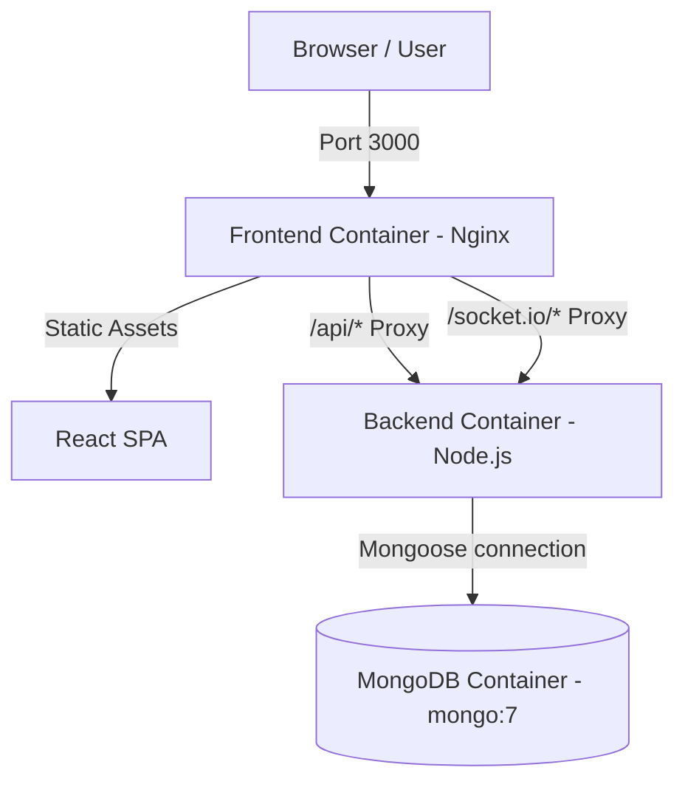

# Deployment & Operations Guide — Power-Grid-Manager

This document provides step-by-step instructions for running, evaluating, verifying, and troubleshooting the **Power-Grid-Manager** containerized application using Docker Compose.

---

## 1. Zero-Configuration Reviewer Quickstart

A reviewer with only **Git**, **Docker**, and **Docker Compose** can launch the entire stack in one step without manual environment setup, database installation, or seed commands:

```bash
git clone https://github.com/aryansingh0059/Power-Grid-manager.git
cd Power-Grid-Manager
docker compose up
```

Once running:
- **Frontend SPA**: [http://localhost:3000](http://localhost:3000)
- **Backend API Health Check**: [http://localhost:4000/api/health](http://localhost:4000/api/health)
- **MongoDB**: `localhost:27017`

---

## 2. Environment Variables & `.env.example`

All environment variables have safe defaults built directly into the Docker Compose setup. No manual editing of `.env` is required for evaluation.

| Variable | Purpose | Required / Optional | Default Value |
|---|---|---|---|
| `PORT` | Backend HTTP API port | Required | `4000` |
| `NODE_ENV` | Runtime mode (`development` / `production`) | Required | `production` |
| `MONGO_URI` | MongoDB connection string | Required | `mongodb://mongo:27017/pgm` |
| `OPENAI_API_KEY` | OpenAI Key for incident summary generation | Optional | `""` (Degrades gracefully to deterministic summaries) |
| `OPENAI_MODEL` | OpenAI Model identifier | Optional | `gpt-4o-mini` |
| `VITE_API_BASE_URL` | Base URL for frontend API requests | Optional | `""` (Empty default lets Nginx handle proxying) |

---

## 3. Architecture & Service Orchestration

Docker Compose orchestrates three required services:



1. **`mongo`**: Official MongoDB 7 image with persistent volume `mongo_data` and healthcheck.
2. **`backend`**: Node.js Express API & Socket.IO server. Waits for `mongo` to be healthy, automatically connects with retry backoff, and seeds the synthetic power grid.
3. **`frontend`**: React 18 SPA built and served via Nginx. Reverse-proxies `/api/` and `/socket.io/` requests to `http://backend:4000`.

---

## 4. Automatic Database Seeding

On initial boot, the backend automatically runs `seedDatabaseIfNeeded()`. If the database is empty, it populates the KSDB synthetic grid network:

- **Substations**: 3
- **Feeders**: 9
- **Distribution Transformers (DTs)**: 108 (~40% with recorded topology, ~60% without recorded topology)
- **Poles**: ~3,000 (~9% poles without devices)
- **Hardware Devices**: Smart meters and fault indicators (including firmware 1.2.x devices)

*Idempotency*: Subsequent container restarts detect existing records and skip re-seeding without data corruption or duplicate key errors.

---

## 5. Clean Environment Reset Procedure

To perform a complete clean-slate reset (purge database volume, rebuild containers, and re-seed from scratch):

```bash
# 1. Stop containers and purge persistent volumes
docker compose down -v

# 2. Build without cache and start containers
docker compose build --no-cache
docker compose up
```

---

## 6. End-to-End Verification Checklist

Verify complete functionality:

1. **Health Check**:
   ```bash
   curl http://localhost:4000/api/health
   ```
   *Expected Response*: `{"status":"ok","db":"connected"}`

2. **Frontend Map & Telemetry**:
   Open `http://localhost:3000` in browser. Confirm Leaflet map renders poles and top bar shows status `ONLINE`.

3. **Simulator Target & Fault Injection**:
   - In Demo Studio / Simulator Panel, click **Use demo target**.
   - Click **Inject Span Fault**.
   - Observe real-time incident creation via Socket.IO without refreshing page.
   - Click **Assign Crew**, **Resolve**, and **Verify Restoration**.

4. **Automated Unit Tests**:
   ```bash
   npm run test:core
   ```
   *Expected Output*: All core backend & simulator unit tests pass.

---

## 7. Troubleshooting Encountered Issues

### Issue 1: Database Startup Race Condition
- **Symptom**: Backend crashed on startup because MongoDB took a few seconds to accept connections.
- **Resolution**: Implemented exponential retry backoff in `packages/backend/src/db/connection.ts` and set `depends_on: { mongo: { condition: service_healthy } }` in `docker-compose.yml`.

### Issue 2: Browser CORS / Container Hostname Exposure
- **Symptom**: Browser JavaScript trying to connect to internal Docker hostname `http://backend:4000` resulted in `ERR_NAME_NOT_RESOLVED`.
- **Resolution**: Configured Nginx inside `frontend` container to reverse-proxy `/api/` and `/socket.io/` to `http://backend:4000`. The browser uses standard relative requests to `window.location.origin`.

### Issue 3: Missing Shared Type Declarations in Docker Stage 1
- **Symptom**: Docker build failed during `npm run build -w packages/frontend` because `@pgm/shared` types were not built first.
- **Resolution**: Added explicit `RUN npm run build -w packages/shared` step before building frontend and backend packages in Dockerfiles.
